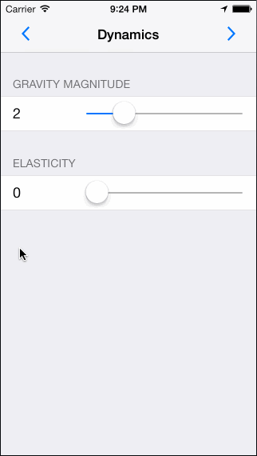
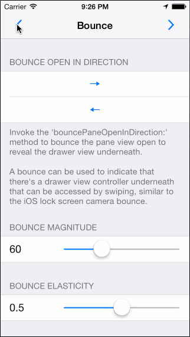
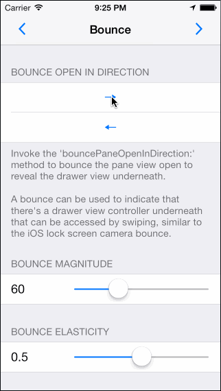

# Introduction

**MSDynamicsDrawerViewController** was written by **[Eric Horacek](https://twitter.com/erichoracek)** for **[Monospace Ltd.](http://www.monospacecollective.com)**

## What is it?

`MSDynamicsDrawerViewController` is a container view controller that manages the presentation of a single "pane" view controller overlaid over one or two "drawer" view controllers. The drawer view controllers are hidden by default, but can be exposed by a user-initiated swipe in the direction that that drawer view controller is hidden in. It uses UIKit Dynamics for all animation—there's not a single call to `animateWithDuration:animations:` in the project.

## UIKit Dynamics?

`MSDynamicsDrawerViewController` integrates with Apple's UIKit Dynamics APIs (new in iOS7) to provide a realistic new feel to the classic drawer navigation paradigm. While the `.gifs` below can do it some justice, it's best to just clone, build, and run the example project on a device to get a feel for it how it performs.

## So what can I do with it?

### Fling


<!-- Remote -->
<!--  -->
<!-- Local -->

### Open and Close


<!-- Remote -->
<!--  -->
<!-- Local -->

### Bounce


<!-- Remote -->
<!--  -->
<!-- Local -->

### Replace


<!-- remote -->
<!--  -->
<!-- Local -->

# Installation

Add the following to your `Podfile` and run `$ pod install`.

``` ruby
pod 'MSDynamicsDrawerViewController'
```

 If you don't have CocoaPods installed or integrated into your project, you can learn how to do so [here](http://cocoapods.org).

# Documentation

## CocoaDocs

Documentation for `MSDynamicsDrawerViewController` is available online via [CocoaDocs](http://cocoadocs.org/docsets/MSDynamicsDrawerViewController/).

## Xcode

If you would like to install the `MSDynamicsDrawerViewController` documentation into Xcode, you can do so by first installing [Appledoc](https://github.com/tomaz/appledoc/) (`$ brew install appledoc`), and then by running the `Documentation` target in the `MSDynamicsDrawerViewController.xcodeproj` in the root of repository.

# Example

`Example.xcworkspace` in the `Example` directory serves as an example implementation of `MSDynamicsDrawerViewController`. It uses Cocoapods to link with the `MSDynamicsDrawerViewController` source files in the root directory as a development pod. As such, use the example `xcworkspace` and not the `xcproj`.

# Usage

## Pane View Controller

The pane view controller is the primary view controller, displayed centered and covering the drawer view controllers. The user can swipe anywhere on the pane view controller to reveal the drawer view controllers underneath.

Instances of `UIViewController` can be added as the pane view controller via the `paneViewController` property:

```objective-c
UIViewController *paneViewController = [UIViewController new];
dynamicsDrawerViewController.paneViewController = paneViewController;
```

### Replacing the Pane View Controller

The pane view controller can be replaced with an animation that slides the pane off to the side, replaces it with a new pane, and slides the new pane closed. See the "Replace" `.gif` above to view this animation. You can initiate this animation with the the `setPaneViewController:animated:completion:` method:

```objective-c
UIViewController *paneViewController = [UIViewController new];
[dynamicsDrawerViewController setPaneViewController:paneViewController animated:YES completion^{
    // Successfully set the pane view controller
}];
```

If you don't want the "slide off" portion of this animation, set the value of the `paneViewSlideOffAnimationEnabled` property on your `MSDynamicsDrawerViewController` instance to `NO`.

## Drawer View Controllers

The drawer view controllers are revealed as drawers underneath the pane view controller. Drawer view controllers can be set for any of the cardinal directions (top, left, bottom, or right). The `MSDynamicsDrawerDirection` typedef is used to communicate these directions to the instance of `MSDynamicsDrawerViewController`.

Instances of `UIViewController` can be added as drawer view controllers via the `setDrawerViewController:forDirection:` method:

```objective-c
UIViewController *drawerViewController = [UIViewController new];
[dynamicsDrawerViewController setDrawerViewController:drawerViewController forDirection:MSDynamicsDrawerDirectionLeft];
```

When adding two simultaneous drawer view controllers, they view controllers must be in opposing directions (left/right or top/bottom).

### Replacing or Removing a Drawer

To replace or remove the drawer view controller, just set either the new `UIViewController` instance or `nil` for the desired direction using the method above.

## Opening and Closing the Drawers

The various methods that modify the `paneState` property are the go-to for changing the "open" state of the drawer.

### Non-Animated

If you just want to open or close the drawer without an animation and you only have one drawer view controller, use the `paneState` property:

```objective-c
dynamicsDrawerViewController.paneState = MSDynamicsDrawerPaneStateOpen;
```

If you have more than one drawer view controller, see the *multiple drawer view controllers* section below.

### Animated

If you want to make *animated* changes to the drawer visibility, use the `setPaneState:animated:allowUserInterruption:completion:` method. As with the `paneState` property, this method requires that you have added only a single drawer view controller.

```objective-c
[dynamicsDrawerViewController setPaneState:MSDynamicsDrawerPaneStateOpen animated:YES allowUserInterruption:YES completion:^{
  // Pane has come to rest
}];
```

A key point of consideration when invoking this method is the `allowUserInterruption` parameter. If set to `NO`, the user will be able to perform gestures that "catch" the sliding pane, interrupting the transition and causing the end `paneState` to potentially differ from the value passed for the `paneState` parameter. As such, the completion block is not necessarily called when the pane state has changed—just when it has come to rest. If you require that the pane's state is updated to the specified state *without interruption*, you must pass `YES` for this parameter.

If you have more than one drawer view controller, see the *multiple drawer view controllers* section below.

### With Multiple Drawer View Controllers

If you have more than one drawer view controller added to your `MSDynamicsDrawerViewController` instance, you should to use the "directional" equivalents of the methods above:

* **Non-Animated** `setPaneState:inDirection:`
* **Animated** `setPaneState:inDirection:animated:allowUserInterruption:completion:`.

## Bouncing the Pane Open

The pane can be bounced open by invoking the `bouncePaneOpen` method. If you have more than one drawer view controller, use the `bouncePaneOpenInDirection:` method and specify a direction. See the "Bounce" `.gif` above for an example of this behavior.

A bounce is a good way to indicate that there's a drawer view controller underneath the pane view controller that can be accessed by swiping, similar to the iOS lock screen camera bounce.

## Stylers

`MSDynamicsDrawerViewController` uses an instances of "styler" objects to create unique styles on the child view controllers updated relative to the fraction that drawers are opened/closed. These stylers conform to the `MSDynamicsDrawerStyler` protocol. Stylers can be combined (assuming they aren't overwriting identical attributes) by setting multiple stylers for a single `MSDynamicsDrawerDirection`.

Instances of `MSDynamicsDrawerStyler` are added to `MSDynamicsDrawerViewController` via the `addStyler:forDirection:` method, and instantiated via the `styler` class method:

```objective-c
id <MSDynamicsDrawerStyler> parallaxStyler = [MSDynamicsDrawerParallaxStyler styler]
[dynamicsDrawerViewController addStyler:parallaxStyler forDirection:(MSDynamicsDrawerDirectionLeft | MSDynamicsDrawerDirectionRight)];
```

### Default Styler Classes
 
There are a few default stylers included with `MSDynamicsDrawerViewController`. The `Stylers` menu option in the example project enables you to try these individually or in combination.

* **Parallax Styler** `MSDynamicsDrawerParallaxStyler`
  Creates a parallax effect on the `drawerView` as the frame of the `paneView` is adjusted. Modify the `parallaxOffsetFraction` property to change the amount of parallax that occurs.

* **Fade Styler** `MSDynamicsDrawerFadeStyler`
  Fades the `drawerView` as the frame of the `paneView` is adjusted. Modify the `closedAlpha` property to change the amount of fade that occurs when the `paneView` is closed.

* **Scale Styler** `MSDynamicsDrawerScaleStyler`
  Creates a zoom-in scaling effect on the `drawerView` as the frame of the `paneView` is adjusted. Modify the `closedScale` property to change the scale that occurs when the `paneView` is closed.

### Creating a Custom Styler

As user interacts with a `MSDynamicsDrawerViewController`, the styler classes that are associated with the active drawer direction are messaged via the method `dynamicsDrawerViewController:didUpdatePaneClosedFraction:forDrawerDirection:`. This method enables the styler to changes attributes of the `drawerView`, `paneView`, etc. relative to the `paneClosedFraction`.

It's recommended that custom stylers don't change the `frame` attribute of the `paneView` or the `drawerView` on the `MSDynamicsDrawerViewController` instance. These are modified internally both by the user's gestures and the internal UIKit Dynamics within `MSDynamicsDrawerViewController`. The behavior of `MSDynamicsDrawerViewController` when the frame is externally modified is undefined.

# Requirements

Requires iOS 7.0, ARC, and the QuartzCore Framework.

# Contributing

Forks, patches and other feedback are welcome.

# License

```
Copyright (c) 2012-2013 Monospace Ltd. All rights reserved.

This code is distributed under the terms and conditions of the MIT license.

Permission is hereby granted, free of charge, to any person obtaining a copy
of this software and associated documentation files (the "Software"), to deal
in the Software without restriction, including without limitation the rights
to use, copy, modify, merge, publish, distribute, sublicense, and/or sell
copies of the Software, and to permit persons to whom the Software is
furnished to do so, subject to the following conditions:

The above copyright notice and this permission notice shall be included in
all copies or substantial portions of the Software.

THE SOFTWARE IS PROVIDED "AS IS", WITHOUT WARRANTY OF ANY KIND, EXPRESS OR
IMPLIED, INCLUDING BUT NOT LIMITED TO THE WARRANTIES OF MERCHANTABILITY,
FITNESS FOR A PARTICULAR PURPOSE AND NONINFRINGEMENT. IN NO EVENT SHALL THE
AUTHORS OR COPYRIGHT HOLDERS BE LIABLE FOR ANY CLAIM, DAMAGES OR OTHER
LIABILITY, WHETHER IN AN ACTION OF CONTRACT, TORT OR OTHERWISE, ARISING FROM,
OUT OF OR IN CONNECTION WITH THE SOFTWARE OR THE USE OR OTHER DEALINGS IN
THE SOFTWARE.
```